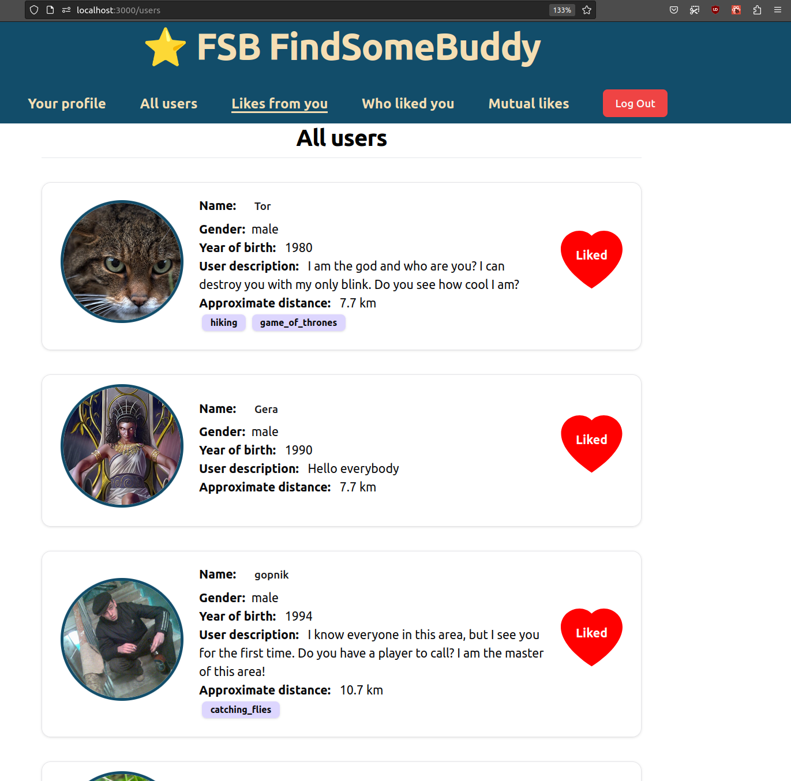

# Documentation

This is a documentation for a fullstack application FSB App. This abbreviation means Find Some Buddy. You can look at live version of the site [here](https://findsomebuddy.vercel.app/)

The functions that this app has:

- A user can register and login

* A user can look at the list of users that also registered there and to like someone

- Mutual likes are shown in a separate tab. For these users you can see emails for connecting

## Technologies that I used for this project:

- Django-rest-framework and Postgres for backend

* Next.js, React for frontend

- TailwindCSS, ShadCN for styling components

## What I want to add in my app later:

I want to add a notifications letters when someone add a like to a user.

## Here are some screenshots:

### Registration Page

### Main page with all users

### Liked users

### Mutual Likes

